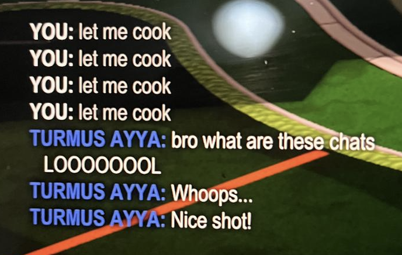

# Rocket League Custom Quickchats
Custom Quickchats for the video game Rocket League!

## Requirements:
- Windows OS (which Rocket League generally runs on anyways)
  - Other operating systems have not been tested.
- [Xbox Controller](https://www.bestbuy.com/site/microsoft-xbox-wireless-controller-for-xbox-series-x-xbox-series-s-xbox-one-windows-devices-pulse-red/6448932.p?skuId=6448932#anchor=productVariations) or KBM
  - Not tested with PlayStation or another brand.


## Setup and Usage

With single scripts, all the code you need to make it work is on one file. With multi-scripts, the code is divided into several files. It is recommended that you use the single-scripts, but you can also use multi-scripts if you have an IDE and want to see the code. MAKE SURE YOU HAVE YOUR INPUT DEVICE (CONTROLLER OR KEYBOARD) CONNECTED BEFORE YOU RUN THE PROGRAM.

### With Single-Scripts:

- Download Python on your computer, if you don't have it already.

- Open the [single-scripts](https://github.com/vivaansinghvi07/rocket-league-custom-quickchats/tree/master/single-scripts) folder on the GitHub Repository. Depending on your platform, download either `controller.py` or `kbm.py`. Save this to your Downloads folder for convenience.
  - View [how to download a file from GitHub](https://www.gitkraken.com/learn/git/github-download#how-to-downlaod-a-file-from-github) if you need help.

- Open the file in a text editor, such as Notepad.
  - Edit your quickchats. Search for the `EDIT QUICKCHATS HERE` comment, and edit them by replacing the placeholders with your chats. Instructions on how to use them are provided. Make sure you don't delete the quotes, and don't use quotes in your quickchats.
  - Edit your chat bind, if it's not Rocket League's default, 't'. Look for the `EDIT KEYBOARD CHAT BIND HERE` comment to do this. Once again, keep your text inside the quotes.
  - Make sure the d-pad codes are correct. **Note: You only need to do this is you are playing with a controller. Otherwise, the `kbm.py` program needs little adjusting (other than quickchats themselves).** If you are not sure, download [`diagnostic.py`](https://github.com/vivaansinghvi07/rocket-league-custom-quickchats/blob/master/diagnostic.py), read the instructions, and run it by following the above steps and entering the following code into your Command Prompt (assuming it was downloaded into the Downloads folder):

    ```
    python Downloads/diagnostic.py
    ```
    - If your d-pad codes do not match, search for the `EDIT DPADS HERE` comment and change the codes as instructed.

- When you have everything set-up, open your Command Prompt
- Copy paste the following command, assuming you put the file in your downloads folder:

  - If you are playing on controller:

    ```
    python Downloads/controller.py
    ```
  - If you are playing on keyboard-mouse

    ```
    python Downloads/kbm.py
    ```
- Press enter, and your script is running! Close the terminal to stop the process.

### With Multi-Scripts:
- This assumes that you have an IDE and you have a decent knowledge of programming. If you don't, the single-scripts are much easier to use.
- Open the files in your IDE. Make sure you have needed libaries installed by using the following commands:
  ```
  $ pip install pynput
  $ pip install inputs
  ```
- All edits you should need to do are in `settings.py`
  - Edit your quickchats: search for the `EDIT QUICKCHATS HERE` comment
  - If controller: Get the codes for your d-pads with `diagnostic.py`
    - If they are different, change them by searching for the `EDIT DPADS HERE` comment
  - If KBM: your quickchats MUST NOT HAVE NUMBERS IN THEM:
    - Also, make sure your quickchats are bound to the numbers 1-4 (the Rocket League defaults) on your keyboard
  - Make sure your chat bind is accurate - if its not `t`, change it where it says `EDIT KEYBOARD CHAT BIND HERE`
- Run the script in the background, read the directions on were the quickchats are in `settings.py`, and enjoy!
  - If you're on KBM, run `kbm.py`.
    - To terminate the program, simply press `esc` on your keyboard.
  - If you're on controller, run `controller.py`.
    - To terminate the program, go back to your terminal and press `Ctrl+C`, or close the running process

Here are the chats being used in-game!


